```{r setup, include=FALSE}
library(knitr)
knitr::opts_chunk$set(echo = FALSE)
```

# Bottom Line Up Front
## The earlier you engage economists in Ecosystem-based Management (EBM), the better the possible analyses

.pull-left[ 
- Biggest impediment to integrating economics is engaging too late

- Key roles:
  +   Trade-off analyses
  +   Policy design
]
 
.pull-right[ 

<font size="2">.image-cap[Reproduced from Kasperski et al. (2021) with permission from NOAA. <br />
https://www.frontiersin.org/articles/10.3389/fmars.2021.631400/full
</font>]
]

???
---
# What is Economics?

*American Economic Association, 2023:*

"Economics can be defined in a few different ways. It’s the study of scarcity, the study of how people use resources and respond to incentives, or the study of decision-making."

???
---

# How does this apply to EBM?

.pull-left[1. Natural resources are scarce
  + How do we maximize the value derived?
  
2. Are stakeholder incentives aligned to achieve societal goals?
  + Is the market missing anything?
]
.pull-right[
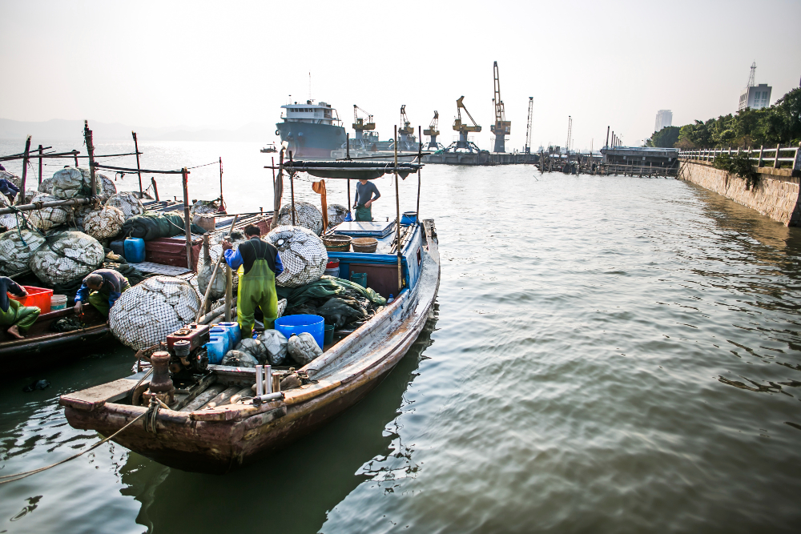
<font size="2"> .imnage-cap[Image by dashu83 on Freepik </font> ]
]

???
---
# Why markets in the first place?
.pull-left[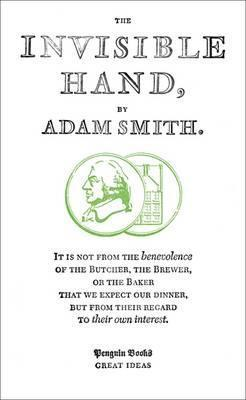
]
.pull-right[
*Under fragile assumptions:*
* The market allocates goods and services optimally
* Social welfare is maximized without intervention
* Cannot make someone better off without making someone worse off
* Goods and services provided at lowest average cost possible

]

???
---

# Is the market missing anything?

.pull-left[Are there impacts and choices not captured by the market?

* Non-market goods and market failures
  + Externalities

* Create difference between the social & private costs/benefits

* Market outcome will not maximize social welfare
]

.pull-right[
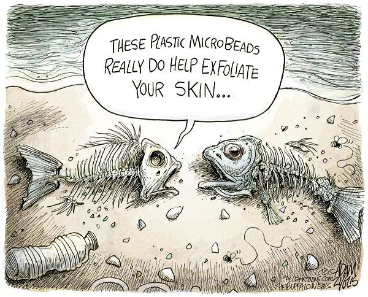
]

???
---
# Other example of externalities?
.pull-left[
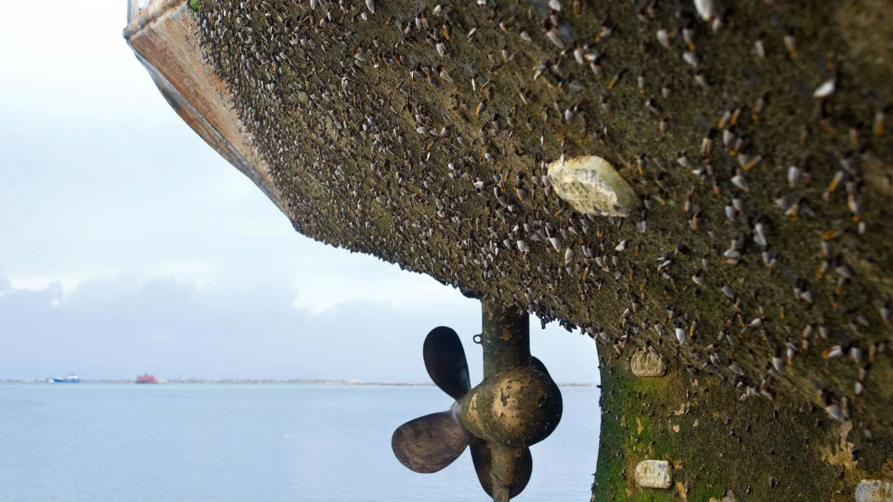
]
.pull-right[

*   Fisheries

*   Shipping

*  Other Industries
]


???
---
.pull-left[ # How do we measure non-market goods?

* Revealed preferences
  +   Travel cost
  +   Averting behavior
  +   Hedonic Price
  +   Cost of illness   
  
* Stated preferences
  +   Surveys
    - Contingent Valuation
    - Choice Modeling
  ]
  .pull-right[
  <font size="2"> https://www.mafmc.org/actions/summer-flounder-mse</font>
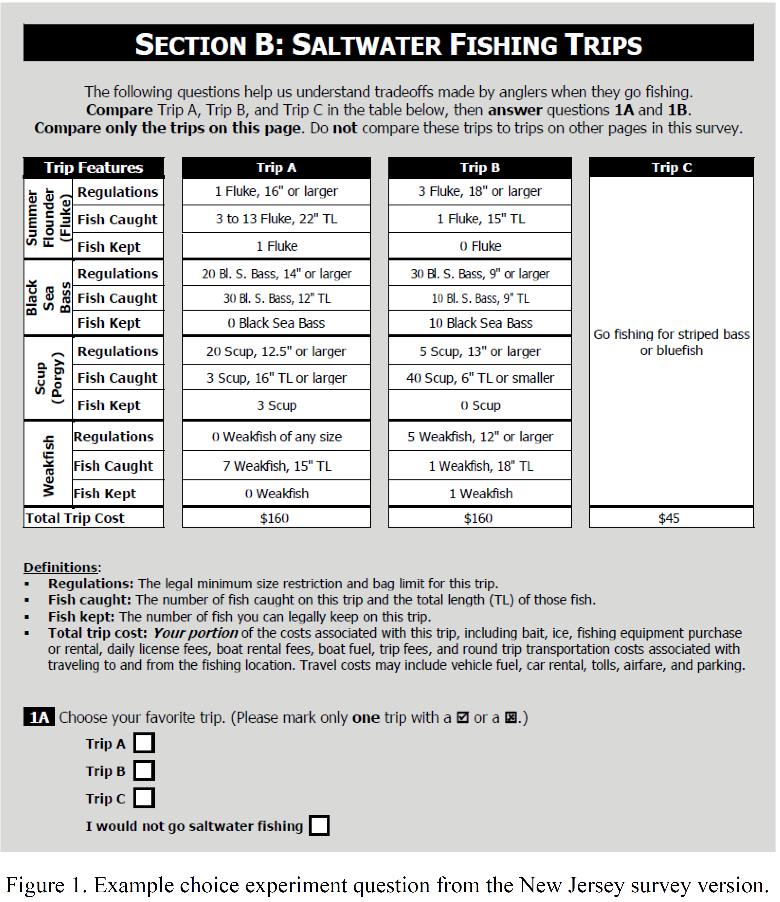
]


???
---
# Why does it matter?

Knowing what drives behavior helps in crafting policy instruments

```{r Summer Flounder, fig.show = "hold", out.width = "50%", fig.align = "center"}
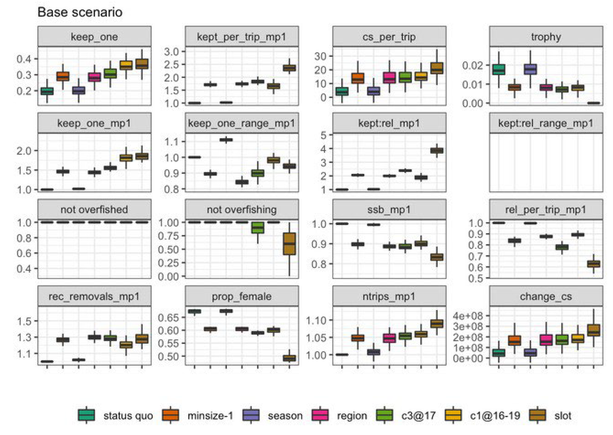
```
<font size="2"> .imnage-cap[ https://www.mafmc.org/actions/summer-flounder-mse]</font>

???
---
Economists' preferred policy instruments are incentive based
.pull-left[* Telling less effective than making it worthwhile
  + Individuals & companies have better information on their own activities]

.pull-right[
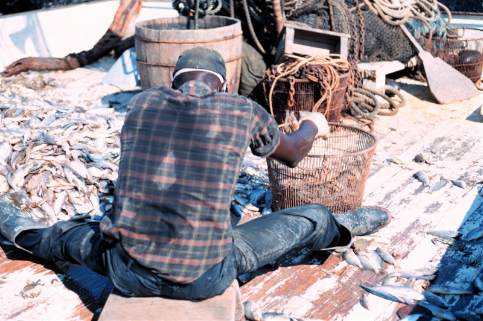
<font size="2"> Reproduced with permission from NOAA.</font>
]
???
---
<font size="3"> Pascoe, S. et al. 2010. Use of incentive-based management systems to limit bycatch and discarding. International Review of Environmental and Resource Economics, 4(2): 123-161. https://dx.doi.org/10.1561/101.00000032
</font>
```{r Incentives, fig.show = "hold", out.width = "90%", fig.align = "center"}
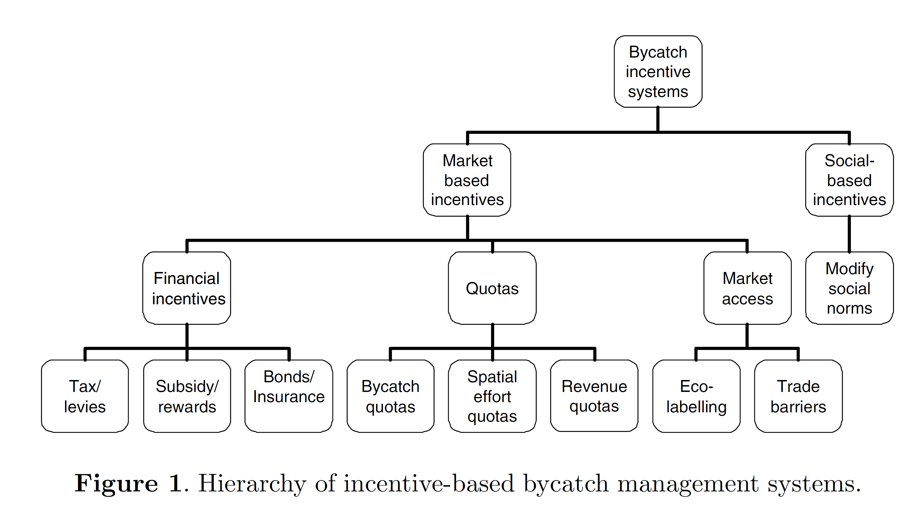
```
???
---
What about multi-sector incentives?


.pull-left[
<font size="3"> DePiper, G.S., Lipton, D.W. and Lipcius, R.N., 2017. Valuing ecosystem services: oysters, denitrification, and nutrient trading programs. Marine Resource Economics, 32(1), pp.1-20. https://doi.org/10.1086/688976 </font>
```{r Oysters, fig.show = "hold", out.width = "100%", fig.align = "center"}
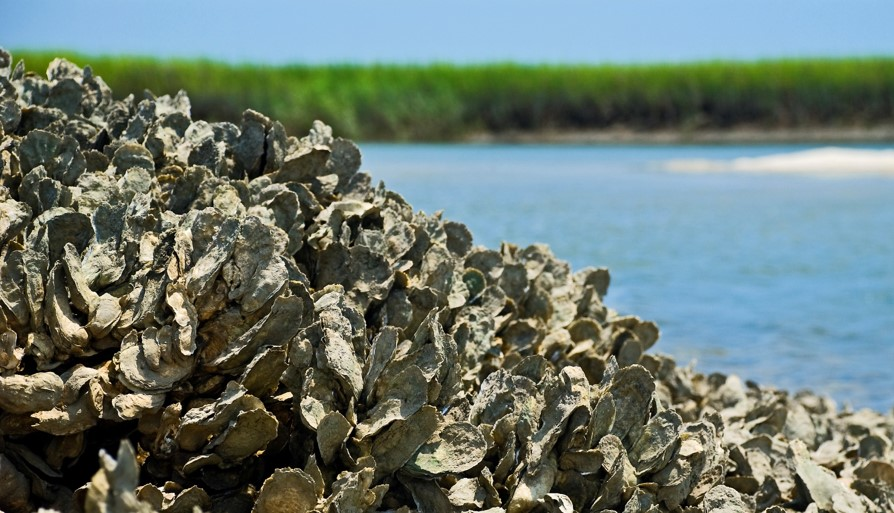
```
]
.pull-right[
```{r Nitrogen, fig.show = "hold", out.width = "75%", fig.align = "center"}
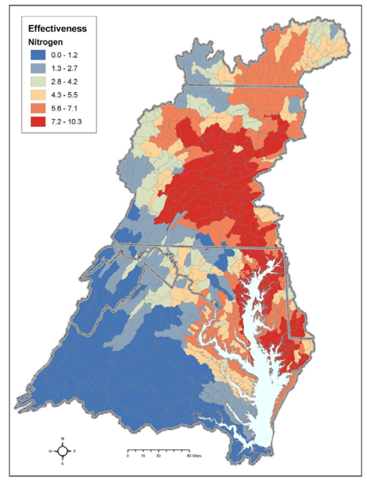
```
]
???
---
# How do we bring information on markets and externalities together?

Total economic value = use value (market & non-market) + non-use value

* Use includes option value & supporting services

* Non-use can only be measured by stated preferences

???
---
# How do we maximize the value derived?
*   Cost-Benefit Analysis
  +    Gold standard 

*   Cost Effectiveness Analysis

*   Multi-criteria Analysis

*   Other

<font size="3"> OECD. 2018. Cost-Benefit Analysis and the Environment: Further Developments and Policy Use, OECD Publishing, Paris. <a href="https://doi.org/10.1787/9789264085169-en">https://doi.org/10.1787/9789264085169-en</a> </font>

???
---
# Economic models can inform all types of questions
.pull-left[ 
```{r MSP, fig.show = "hold", out.width = "90%",fig.link="https://doi.org/10.1073/pnas.1114215109" ,fig.align = "center"}
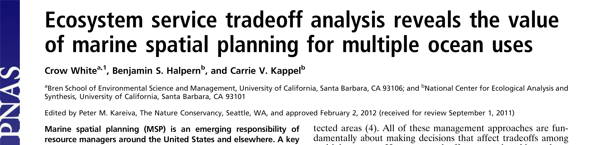
```
```{r MSP_area, fig.show = "hold", out.width = "60%", fig.align = "center"}
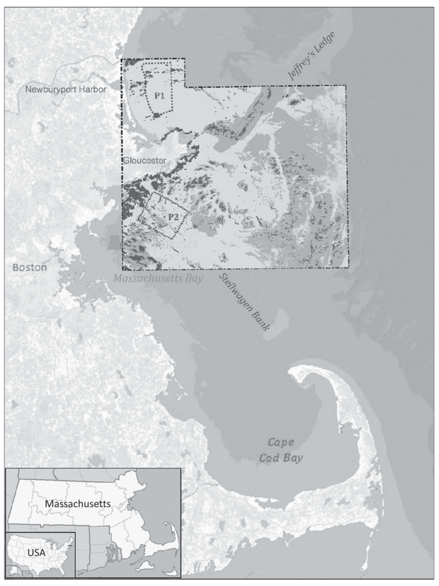
```
]
.pull-right[
```{r Aqua, fig.show = "hold", out.width = "90%", fig.link="https://doi.org/10.1016/j.aquaculture.2014.10.035",fig.align = "center"}
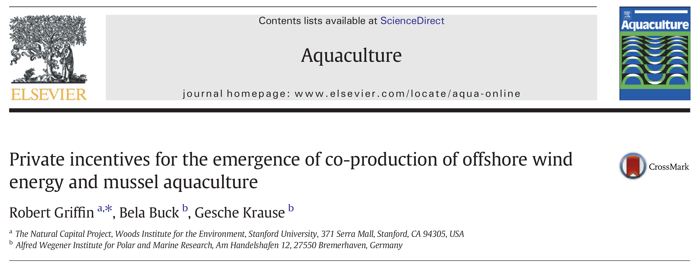
```
```{r Aqua_area, fig.show = "hold", out.width = "55%", fig.align = "center"}
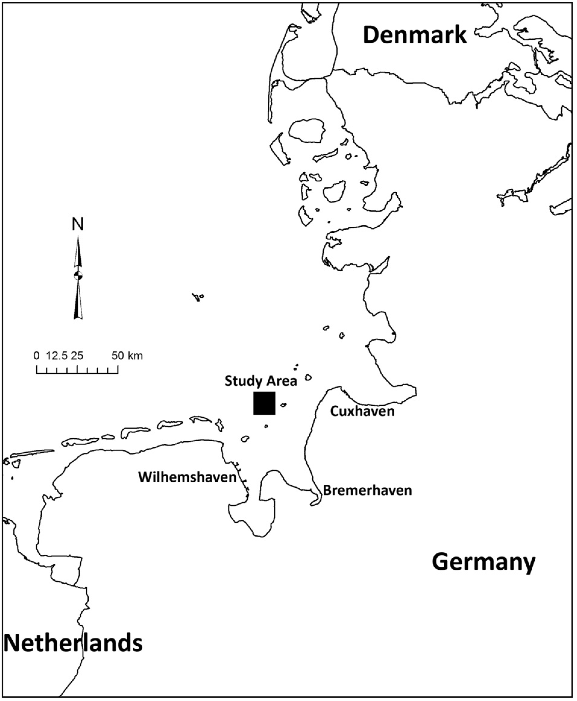
```
]

???
---
# Biggest impediment is engaging too late
<font size="2">Kirkpatrick et al. (2017). Socio-Economic Impact of Outer Continental Shelf Wind Energy Development
on Fisheries in the U.S. Atlantic, Volume I—Report Narrative (BOEM 2017-012; p. 154).
NOAA. https://marinecadastre.gov/espis/#/search/study/100058 </font>
```{r Wind, fig.show = "hold", out.width = "35%", fig.align = "center"}
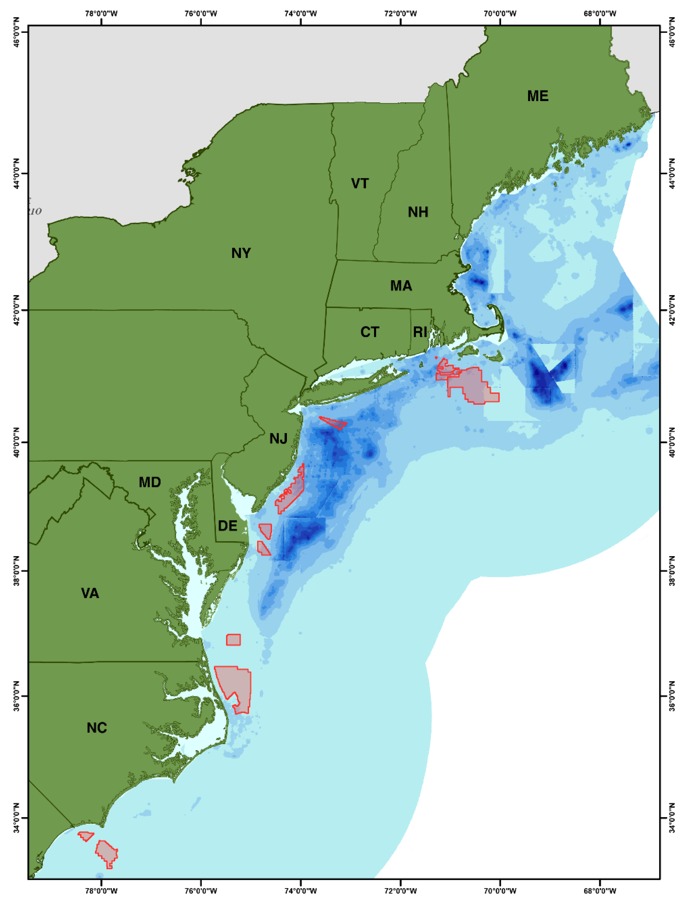
```
???
---
# Don't let the perfect be the enemy of the good
.pull-left[ * Gaps in understanding will exist

* Aim is to make more informed decisions

* Build from simple to complex as needed
]
.pull-right[
```{r Conceptual, fig.show = "hold", out.width = "130%", fig.align = "default"}
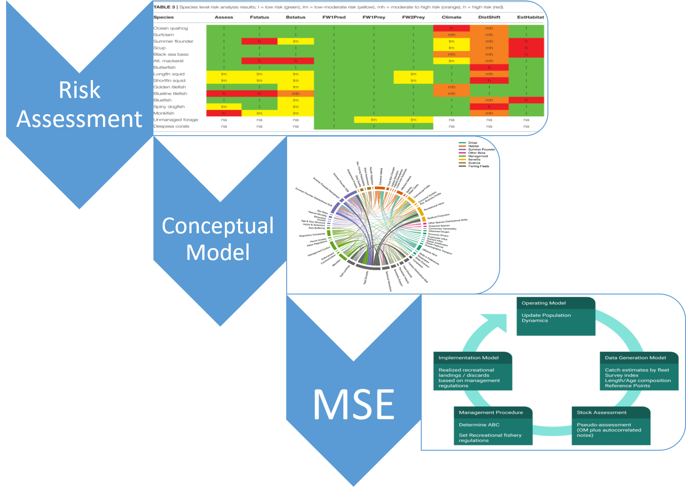
```
]
???
---
# Ecosystem-based management considers trade-offs

Economics can help inform not only what to do, but how to do it
* Benefits & Costs
  + Non-Market Goods
  + Externalities
* Incentives
